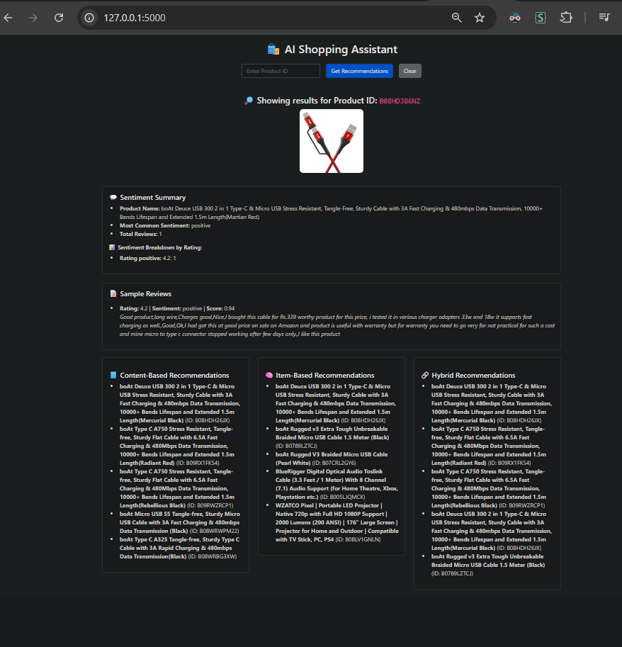
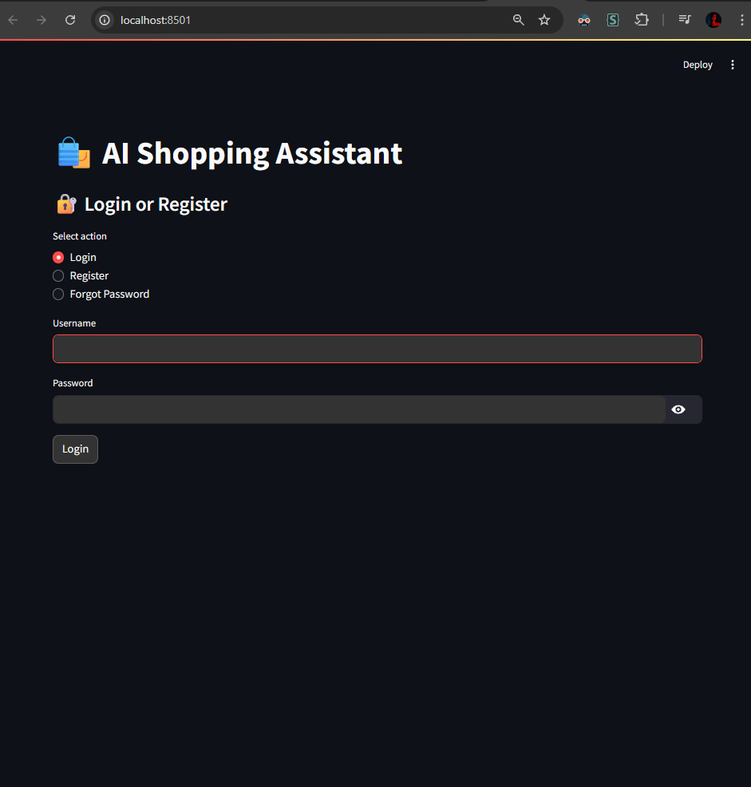
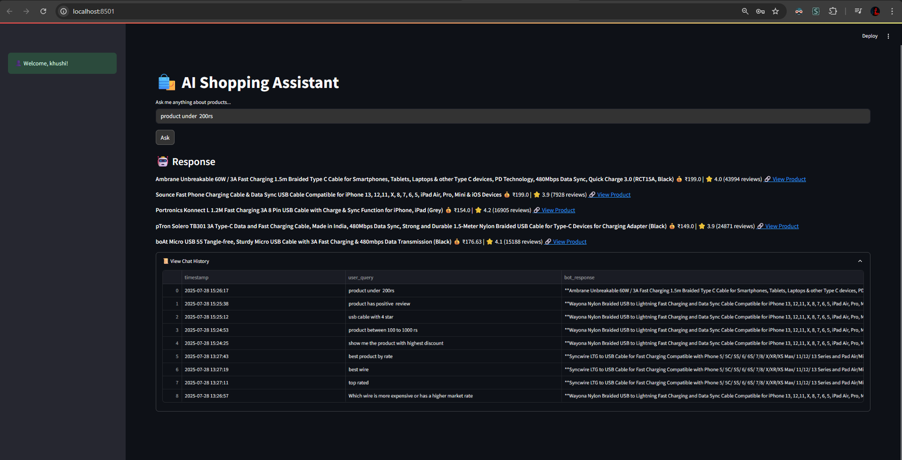

# SmartShopper: Amazon Product Recommendation System

This is a comprehensive machine learning-based product recommendation system built using Amazon product data. **SmartShopper** uses multiple recommendation strategies (content-based, item-based, hybrid) along with a sentiment analysis model to enhance personalization. It also includes a chatbot for user interaction.

---

## 📁 Project Structure

```
├── app.py
├── auth.py
├── clean.py
├── database.py
├── queryHandler.py
├── models
│   ├── hybrid_model.pkl
│   ├── sentiment_analyzer.pkl
│   └── sentiment_results.pkl
├── scripts
│   └── __pycache__
├── contentBasedModeI.py
├── hybridModeI.py
├── itemBasedModeI.py
├── sentiment.py
├── sentimentModeI.py
├── templates
│   └── index.html
├── amazon.csv
├── cleaned amazon.csv
├── contentBased.py
├── GUI.py
├── hybrid.py
├── itemBased.py
├── recommendation.ipynb
├── tempCodeRunnerFile.py
```

---

## 🚀 Features

### 🔍 Recommendation Models

* **Content-Based Filtering**: Recommends similar products based on product features.
* **Item-Based Collaborative Filtering**: Uses user behavior data to recommend items.
* **Hybrid Model**: Combines both methods for improved performance.

### 📊 Sentiment Analysis

* Pretrained model classifies review sentiments (positive/negative).
* Sentiment score boosts recommendation relevance.

### 🤖 Chatbot

* Integrated chatbot interface for interactive user assistance.
* Helps users navigate, discover products, and understand sentiment.
* Built into `GUI.py` and integrated with `app.py` (Flask-based UI).

### 🧼 Data Preprocessing

* Handled missing values, encoding, outlier detection.
* Price normalization using MinMaxScaler.
* Created features like `price_diff`, `review_score`, and encoded `category`.

---

## 📊 Notebooks

* `recommendation.ipynb` contains extensive data analysis, preprocessing, EDA, and feature engineering.

---

## 📸 Screenshot

> 
> 
> 

## 🛠️ Installation

```bash
pip install -r requirements.txt
```

---

## ▶️ Run the App

```bash
python app.py
```

Then go to `http://localhost:5000` in your browser.

---

## 🧺 Run the Chatbot UI

```bash
python GUI.py
```

Or it may be bundled with the main app — depending on setup.

---

## 📊 Datasets

* `amazon.csv`: Raw dataset
* `cleaned amazon.csv`: Cleaned and preprocessed data

---

## 💾 Models

Saved models are stored in the `/models` directory:

* `hybrid_model.pkl`
* `sentiment_analyzer.pkl`
* `sentiment_results.pkl`

---

## 📝 License

This project is licensed under the MIT License.

---

> Built with ❤️ for product intelligence using ML, NLP, and interactive UIs.
